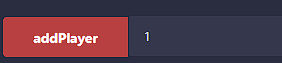

# แนวทางในการแก้ปัญหา
## front-running problem
แก้ปัญหาโดยการที่ player จะต้องใส่ salt มาด้วยเวลาที่จะเลือกตัวเลือก จะเป็นการ commit สิ่งที่ผู้เล่นนั้นเลือก และเมื่อ player ทั้งสองเลือกเสร็จแล้วจึงค่อย reveal ด้วยตัว player เอง ผ่านฟังก์ชัน revealAnswerPlayer เกมจึงจะสามารถเลือกผู้ชนะได้
### revealAnswerPlayer
จะต้องมีเงื่อนไขว่าผู้เล่นทั้งสองต้อง commit ก่อนถึงจะสามารถ reveal ได้ และผู้ส่งต้องใส่เลขไอดีที่ตรงกับที่ตัวเองเลือกมาในตอนเริ่มเกม หลังจากนั้นจึงจะสามารถ reveal ได้

## ปัญหาเงินค้างในระบบ
ทั้งในขั้นตอนของการ addPlayer, input และ reveal ก็จะมีการเซ็ต deadline ไว้ว่า ถ้าเกิดว่ามีเพียงแค่playerเดียวที่กระทำการนั้นและอีกผู้เล่นยังไม่ยอมกระทำภายในเวลาที่กำหนด ผู้เล่นที่กระทำไปแล้วสามารถที่จะถอนเงินrewardออกมาได้ด้วยตัวเองผ่านฟังก์ชัน withdraw ต่างๆที่มีในแต่ละขั้นตอนแยกกันไป

withdraw ในขณะที่ผู้เล่นไม่ครบ

 
withdraw ในขณะที่ผู้เล่นอีกคนไม่ยอมเลือก choice

 
withdraw ในขณะที่ผู้เล่นอีกคนไม่ยอม reveal

 
## ปัญหาไม่รู้ว่าตัวเองเลขไอดีอะไร
ปัญหานี้แก้ด้วยการที่ addPlayer จากตอนแรกที่ไม่ต้องใส่อะไรมา แต่ตอนนี้ต้องใส่เลขไอดีที่ตนเองต้องการจะใช้มาด้วย ถ้าเกิดว่าไม่ได้ก็จะต้องไปใช้อีกเลขนึงแทน เป็นการให้ผู้เล่นเลือกไปในตัวเองเลยว่าอยากจะเล่นด้วยเลขไอดีอะไร

## ปัญหาการทำให้ contract มีการ transact กับ contract ได้ในหลายๆรอบ
เมื่อเล่นจนเสร็จไปรอบนึงแล้วหรือเกิดการwithdrawขึ้น ระบบจะทำการคืนเงินrewardให้กับคนที่ควรได้รับและ reset value เป็นค่าเริ่มต้นทั้งหมดผ่านฟังก์ชัน resetvalue ทำให้สามารถ transact กับ contract นี้ได้หลายๆรอบ

# ตัวอย่าง
### กรณีที่ผู้เล่น 1 ชนะ และ ผู้เล่น 2 แพ้
เงินเริ่มต้นของผู้เล่น 1 และ 2 

  
  
ผู้เล่นที่ 1 ก็เลือก Input เป็น 0 (rock) และ salt = 0

  
  
ผู้เล่นที่ 2 ก็เลือก Input เป็น 1 (fire) และ salt = 1

  
ซึ่งการที่ผู้เล่นส่ง input มานั้นก็คือได้ทำการ commit ไปเรียบร้อยแล้ว ต่อมาผู้เล่นก็จะต้อง reveal input ที่ตนเคย commit เอาไว้ผ่านฟังก์ชัน revealAnswerPlayer

ผู้เล่นที่ 1 ก็จะ reveal ด้วยค่าที่ตนเคยใส่มาใน input

ผู้เล่นที่ 1 ก็จะ reveal ด้วยค่าที่ตนเคยใส่มาใน input เหมือนกัน

ผลลัพธ์สุดท้ายที่ผู้เล่น 1 ชนะ เพราะ rock ชนะ fire ทำให้ได้เงินที่วางเดิมพันไว้ และผู้เล่นที่ 2 แพ้ก็เสียเงินเดิมพันไป 
  
  
### กรณีที่ผู้เล่นทั้ง 2 คน เสมอกัน
เงินเริ่มต้นของผู้เล่น 1 และ 2 

  
  
Input ของผู้เล่นที่ 1 

  
  
Input ของผู้เล่นที่ 2 

  
  หลังจากนั้นก็จะมีลักษณะการเล่นแบบเดียวกับกรณีที่ผ่านมา

ผลลัพธ์สุดท้ายที่ผู้เล่น 1 และ ผู้เล่นที่ 2 เสมอกัน ทำให้ต่างคนต่างได้เงินคืนเท่าที่ลงไว้ตอนแรก 
